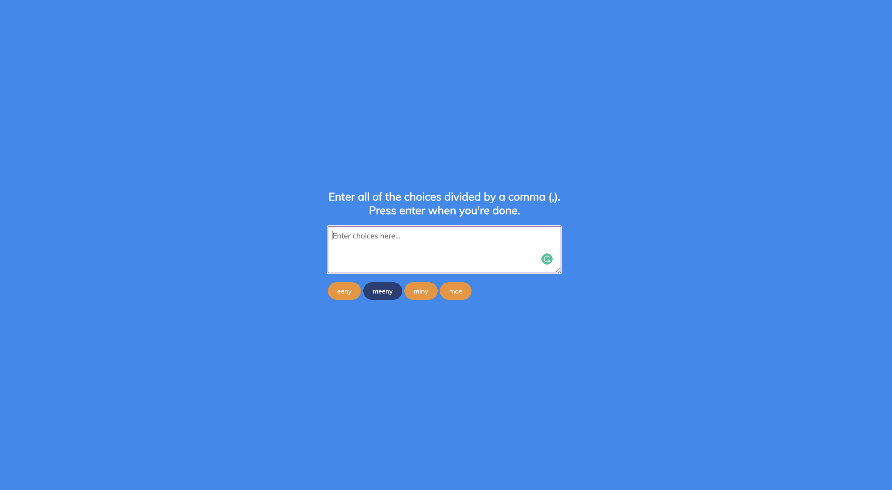

# 50 Projects in 50 Days - Random Choice Picker

This is a code along project in the [50 Projects In 50 Days - HTML, CSS & JavaScript Udemy Course](https://www.udemy.com/course/50-projects-50-days/). Sharpen your skills by building 50 quick, unique & fun mini projects.

## Table of contents 😌

- [Overview](#overview)
  - [The project](#the-project)
  - [Screenshot](#screenshot)
  - [Links](#links)
- [My process](#my-process)
  - [Built with](#built-with)
  - [What I learned](#what-i-learned)
  - [Continued development](#continued-development)
  - [Code snippets](#im-really-proud-of-these-code-snippets%EF%B8%8F)
  - [Useful resources](#useful-resources)
- [Author](#author)
- [Acknowledgments](#acknowledgments)

## Overview👋🏾

Welcome to the 13<sup>th</sup> mini-project of the course!

### The project😥

In this project users will be able to:

- Build a random choice picker site that rotates through the options provided by the user and picks one at random.

### Screenshot🌇



### Links👩🏾‍💻

- Solution URL: (https://github.com/MaianneThornton/50in50_RandomChoicePicker)
- Live Site URL: (https://app.netlify.com/sites/candid-kataifi-d18312/deploys/)

## My process💭

This is a simple project that I started by marking out initial classes and id's in the html file to be later used for styling. Next I began styling the css by styling the textarea and the tags. I then added functionality by way of JavaScript to create the spans that hold the spans once entered by the user and created the automation that picks a choice by random.

### Built with👷🏾‍♀️

- Semantic HTML5 markup
- CSS custom properties
- Flexbox
- JavaScript

### What I learned👩🏾‍🏫

I learned how to focus the cursor on a specific point when the page loads.


### Continued development🔮

In the future I plan on continuing to practice using event listeners to make my pages more functional.

I plan on creating more projects so that I can practice timing out events.

I plan on creating more elements dynamically in JavaScript verses hard coding them in HTML.

I also plan on continuing to learn the best ways to phrase git commits, so that future viewers can fully understand the changes that have occurred.

### I'm really proud of these code snippets✂️


```js
function randomSelect() {
    // the number of times to hightlight each span until stopping
    const times = 30
    // pick a random tag every 100ms
    const interval = setInterval(() => {
        const randomTag = pickRandomTag()

        // animates by highlighting and un-highlighting the spans randomly
        highlightTag(randomTag)

        setTimeout(() => {
            unHighlightTag(randomTag)
        }, 100);
    }, 100);
    // stops the animation on a random tag
    setTimeout(() => {
        clearInterval(interval)

        setTimeout(() => {
            const randomTag = pickRandomTag()

            highlightTag(randomTag)
        }, 100);
    }, times * 100);
}

function pickRandomTag() {
    // brings all the spans in via a nodeList
    const tags = document.querySelectorAll('.tag')
    // (Math.floor)rounds down, (Math.random)random decimal multiplied by the length of the tags nodeList
    return tags[Math.floor(Math.random() * tags.length)]
}
```

### Useful resources📖

- [Resource 1](https://www.w3schools.com/jsref/dom_obj_event.asp) - This is list of all HTML DOM Events. Very useful in defining the different Events that the browser can listen for.

## Author🔎

- Website - [Portfolio Site](https://www.maiannethornton.com/Portfolio/index.html)
- Frontend Mentor - [@MaianneThornton](https://www.frontendmentor.io/profile/MaianneThornton)
- GitHub - [@MaianneThornton](GitHub.com/MaianneThornton)
- Twitter - [@MaianneThornton](https://twitter.com/MaianneThornton)
- LinkedIn - [@MaianneThornton](https://www.linkedin.com/in/maiannethornton/)

## Acknowledgments🙏🏾

Special Thanks go to [Brad Traversy](http://www.traversymedia.com/) and [Florin Pop](http://www.florin-pop.com/) creating the course and making reviewing concepts fun 😊.
